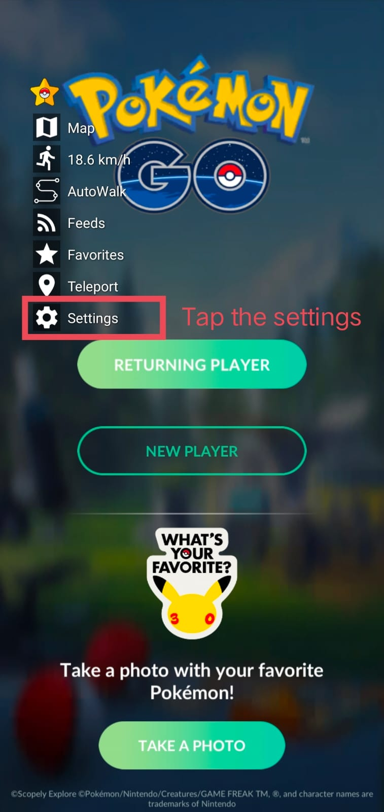
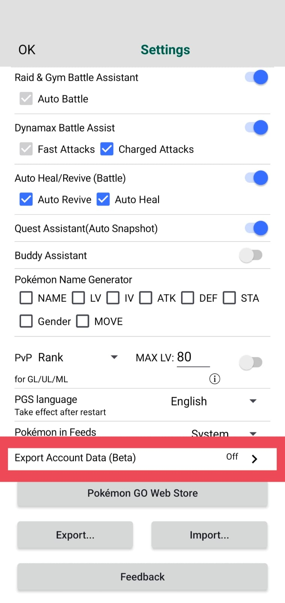
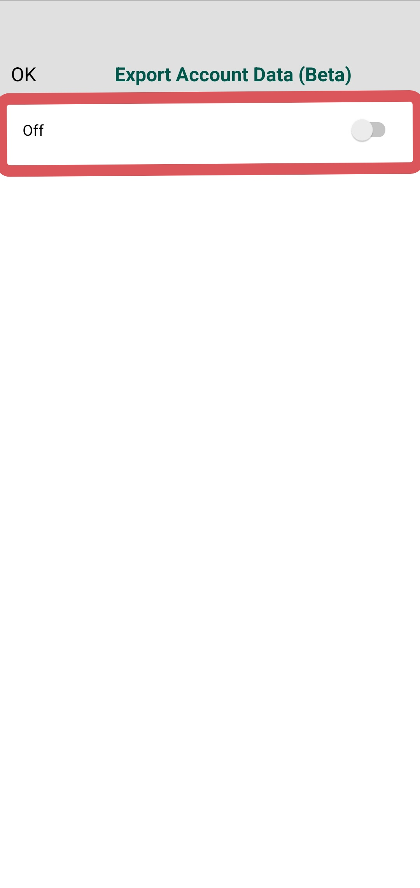
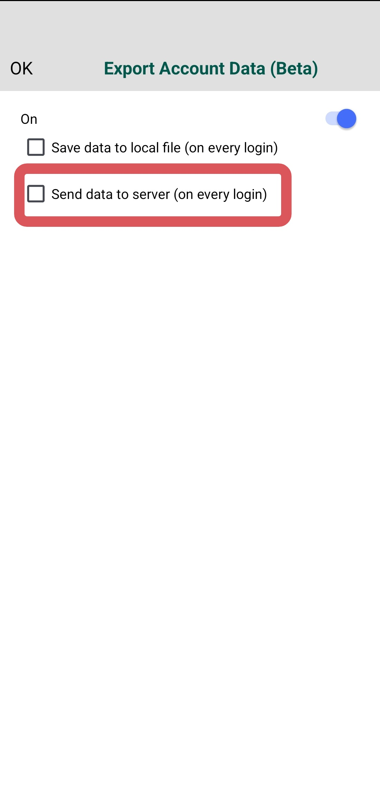
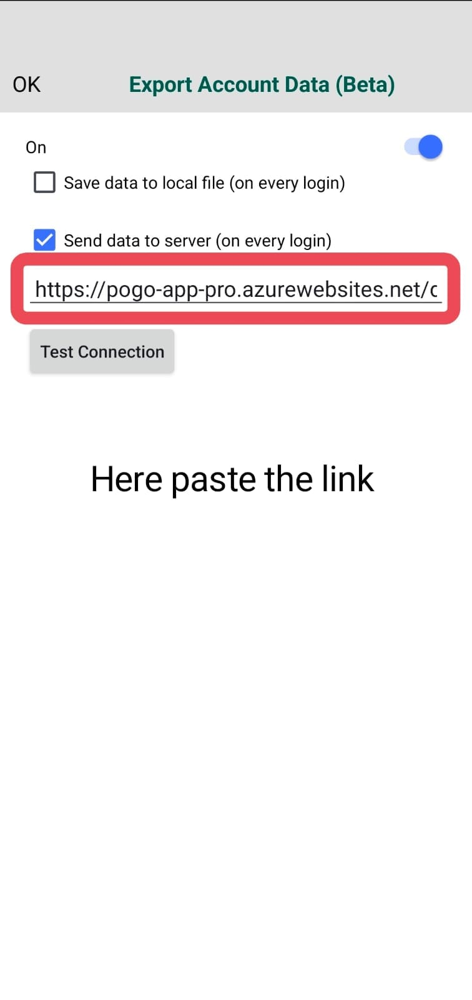

# ⚡ PGSAccount — Pokémon GO Multi-Tenant Account Manager

> **Live Web App**: [https://pogo-app-pro.azurewebsites.net/](https://pogo-app-pro.azurewebsites.net/)  
> A real-time, multi-tenant web dashboard designed to manage, monitor, and inspect Pokémon GO accounts, shiny collections, IV appraisals, item bags, and PvP rankings seamlessly.

---

## 🌟 Key Highlights

* **🔄 Automated Real-Time Sync**: Ingests Pokémon inventory, item bags, levels, badges, Stardust, and PokéCoins automatically on every in-game login.
* **🛡️ Multi-Tenant Privacy**: Every user gets a private webhook token and can only see their own accounts.
* **📊 Complete Gen 1–9 Pokédex**: Automatic species resolution, accurate sprite rendering, and elemental typing.
* **🎯 Exact IV & Level Calculator**: Attack, Defense, and Stamina appraisal breakdown (0–100% IV) alongside accurate Level 1–50+ calculation.
* **⚔️ PvP Great & Ultra League Rankings**: Instantly highlights optimal PvP stat-products for Great League (≤1500 CP) and Ultra League (≤2500 CP).
* **🏷️ Smart Tag Filters**:
  * ✨ **Shinies** & 🌟 **Shundos** (100% IV Shiny)
  * 💯 **Hundos** (100% IV)
  * 📍 **Location Cards (BG)** & Event Memorabilia
  * 🎭 **Costumes** & Special Regional Event Forms
  * 💀 **Shadow** & 🔮 **Purified**
  * 🍀 **Lucky Pokémon**
  * 👑 **Legendaries, Mythicals & Ultra Beasts**
* **🎒 Full Item Bag Inspection**: Exact counts and icons for Poké Balls, Berries, Evolution Items, TMs, Raid Passes, and Incenses.

---

## 📋 Requirements

> **Note:** To use the live synchronization feature, you must have **PGSharp Standard / Premium Edition**, as the *Export Account Data* feature is available on paid PGSharp versions.

---

## 🚀 How to Set Up & Connect PGSharp (Step-by-Step)

### Step 1: Get Your Webhook Link

1. Visit the web app: [https://pogo-app-pro.azurewebsites.net/](https://pogo-app-pro.azurewebsites.net/)
2. Register an account or log in with your credentials.
3. Open your **Profile** in the dashboard and copy your personal **Webhook URL** (example: `https://pogo-app-pro.azurewebsites.net/api/webhook/YOUR_UNIQUE_TOKEN`).

---

### Step 2: Configure PGSharp Settings

#### 1. Open PGSharp Settings
Launch the PGSharp app on your device, tap the PGSharp floating icon, and open **Settings**.

---

#### 2. Scroll to "Export Account Data (Beta)"
Scroll down through the settings menu until you find the **Export Account Data (Beta)** option, then tap on it.

---

#### 3. Enable the Feature
Toggle the switch **ON** at the top right to enable the account export feature.

---

#### 4. Select "Send data to server (on every login)"
You will see two options with checkboxes:
1. *Save data to local file (on every login)*
2. *Send data to server (on every login)*

Tick the second option (**Send data to server**).

---

#### 5. Paste Your Webhook URL
A text box will appear below. Paste your unique Webhook URL that you copied from your web app dashboard profile.

---

### 🎉 All Done!
Whenever you log into any Pokémon GO account through PGSharp, the web dashboard will automatically receive and sync your inventory, Pokémon stats, IVs, and item bags in real-time!

---

## 🔒 Account Safety & Privacy Guarantee

> **Your game account and login credentials are 100% safe.**

* 🚫 **Zero Passwords or Credentials**: The web app **NEVER** asks for, receives, or stores your Pokémon GO passwords, email credentials, PTC login tokens, or device IP addresses.
* 📦 **In-Game Stats Only**: The PGSharp webhook only exports read-only game state data (Trainer nickname, trainer level, Pokémon list, IVs, item bag counts, Stardust, and PokéCoins).
* 🔐 **Private & Encrypted**: All transmission happens over encrypted HTTPS directly to your private, isolated user database.

---

## 🏗️ Architecture & Tech Stack

* **Frontend**: Responsive Single-Page Application (SPA), Tailwind CSS, Vanilla JavaScript (ES6+), FontAwesome
* **Backend**: Python, Flask, Gunicorn
* **Database**: Persistent SQLite Engine on Azure persistent storage with isolated multi-tenant records
* **Hosting**: Microsoft Azure App Service (Linux)

---

## 📞 Support, Help & Contact

If you have any issues connecting your webhook, need assistance, or want to suggest new features:

* **Telegram**: [@Joyboy_2106](https://t.me/Joyboy_2106)
* **GitHub Issues**: Feel free to open an [Issue](../../issues) on this repository!
